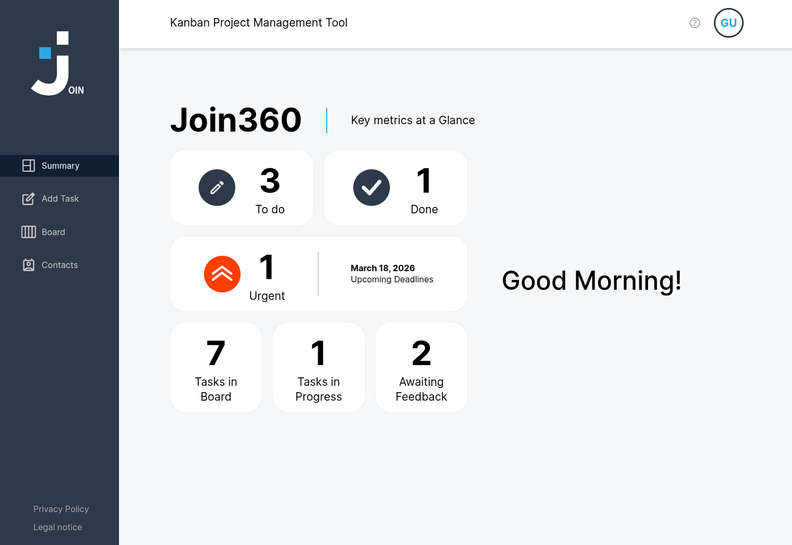

# 📋 Join - Kanban Task Management

<div align="center">
  
  
  ### A lightweight and collaborative planning tool for software development teams
  
  [](https://join.viktor-wilhelm.de)
  [](https://github.com/rockviktor78/join)
  [](LICENSE)
</div>

---

## 📖 About The Project

**Join** is a modern Kanban board application designed to streamline task management for development teams. Built as a Multi-Page Application (MPA), Join offers an intuitive interface for creating, organizing, and tracking tasks through their complete lifecycle - from ToDo to Done.

Whether you're working solo or collaborating with a team, Join provides all the essential features you need: task creation with detailed descriptions, drag-and-drop functionality, contact management, and real-time progress tracking with subtasks.

---

## 📸 Screenshots

### Dashboard Overview

*The Summary Dashboard shows all your tasks at a glance with upcoming deadlines*

### Kanban Board

*Drag and drop tasks between columns to update their status*

### Task Details

*View and edit all task information including subtasks and assignments*

### Contact Management

*Manage your contacts and assign them to tasks*

### Mobile View
<div align="center">
  
</div>

*Fully responsive design works on all devices*

> **Note:** To add screenshots, create a folder `assets/screenshots/` and add your images there. Recommended screenshot names:
> - `dashboard.png` - Summary/Dashboard view
> - `board.png` - Kanban board with tasks
> - `task-detail.png` - Task detail overlay
> - `contacts.png` - Contact list view
> - `mobile-board.png` - Mobile board view

---

### ✨ Key Features

#### 🔐 User Management & Authentication
- **User Registration** - Create your account with email, name, and password
- **Secure Login** - Access your personalized dashboard
- **Guest Access** - Try all features without registration
- **Session Management** - Secure logout functionality

#### 📊 Dashboard & Summary
- **Task Overview** - See total tasks in each status (ToDo, In Progress, Awaiting Feedback, Done)
- **Upcoming Deadlines** - Track tasks with nearest due dates
- **Personalized Greeting** - Time-based welcome messages

#### 🎯 Kanban Board & Task Management
- **Visual Workflow** - Four-column Kanban layout (ToDo, In Progress, Awaiting Feedback, Done)
- **Task Cards** - Display category, title, description preview, assigned users, and priority
- **Drag & Drop** - Intuitive task movement between columns (Desktop & Mobile)
- **Task Details** - Click to view complete task information
- **Quick Add** - Create tasks directly from any column with "+" icon
- **Search Functionality** - Find tasks instantly by title or description
- **Priority Levels** - Visual indicators for Urgent, Medium, and Low priority tasks

#### ✅ Advanced Task Features
- **Subtask Management** - Break down tasks into smaller actionable items
- **Progress Tracking** - Visual progress bars showing completion status
- **Task Editing** - Modify all task details including title, description, due date, priority, and assignments
- **Task Deletion** - Remove completed or obsolete tasks
- **Category System** - Organize tasks as "Technical Tasks" or "User Story"

#### 👥 Contact Management
- **Contact List** - Alphabetically sorted contacts with email addresses
- **Add Contacts** - Create new contacts with name, email, and phone
- **Edit & Delete** - Keep your contact list up-to-date
- **Task Assignment** - Assign contacts to tasks directly
- **Contact Details** - View full information including email and phone number

#### 📱 Responsive Design
- **Mobile Optimized** - Works seamlessly on devices as small as 320px
- **Desktop Experience** - Full-featured interface for larger screens
- **Vertical Board Layout** - Mobile-friendly column stacking
- **Touch-Friendly** - Optimized touch interactions

#### 💫 User Experience
- **Instant Feedback** - Toast notifications for all actions
- **Hover Effects** - Visual feedback on interactive elements
- **Form Validation** - Custom validation without HTML5 defaults
- **Loading States** - Disabled buttons during operations
- **Smooth Transitions** - 75-125ms animations on UI elements

---

## 🛠️ Built With

### Frontend
- **HTML5** - Semantic markup
- **CSS3** - Custom styling with CSS variables
- **JavaScript (ES6+)** - Modern JavaScript with modules
- **Vanilla JS** - No frameworks, pure JavaScript

### Backend & Database
- **Firebase Authentication** - User management
- **Firebase Realtime Database** - Data storage and synchronization

### Development Tools
- **Live Server** - Development server
- **Git & GitHub** - Version control
- **JSDoc** - Code documentation

---

## 🚀 Getting Started

### Prerequisites

- Node.js (v14 or higher)
- npm (v6 or higher)
- A modern web browser (Chrome, Firefox, Safari, or Edge)
- Firebase account (for backend setup)

### Installation

1. **Clone the repository**
   ```bash
   git clone https://github.com/rockviktor78/join.git
   cd join/join-app
   ```

2. **Install dependencies**
   ```bash
   npm install
   ```

3. **Configure Firebase**
   
   Create a Firebase project at [Firebase Console](https://console.firebase.google.com/)
   
   Copy the example config file:
   ```bash
   cp config/firebase.config.js.example config/firebase.config.js
   ```
   
   Update `config/firebase.config.js` with your Firebase credentials:
   ```javascript
   export const firebaseConfig = {
     apiKey: "YOUR_API_KEY",
     authDomain: "YOUR_AUTH_DOMAIN",
     databaseURL: "YOUR_DATABASE_URL",
     projectId: "YOUR_PROJECT_ID",
     storageBucket: "YOUR_STORAGE_BUCKET",
     messagingSenderId: "YOUR_MESSAGING_SENDER_ID",
     appId: "YOUR_APP_ID"
   };
   ```

4. **Start the development server**
   ```bash
   npm run dev
   ```
   
   The application will open automatically at `http://localhost:5500`

---

## 📁 Project Structure

```
join-app/
├── index.html                 # Login/Signup page (entry point)
├── style.css                  # Global styles
├── package.json               # Project dependencies
│
├── assets/
│   ├── fonts/                 # Custom fonts
│   ├── img/                   # Images and icons
│   └── templates/             # HTML templates
│
├── config/
│   ├── firebase.config.js     # Firebase configuration
│   └── firebase.config.js.example  # Config template
│
├── html/
│   ├── summary.html           # Dashboard overview
│   ├── board.html             # Kanban board
│   ├── add-task.html          # Task creation form
│   ├── contacts.html          # Contact management
│   ├── help.html              # Help documentation
│   ├── legal-notice.html      # Legal information
│   └── privacy-policy.html    # Privacy policy
│
├── scripts/
│   ├── firebase.js            # Firebase initialization
│   ├── dataStore.js           # Data management layer
│   ├── utilities.js           # Shared utility functions
│   ├── preloader.js           # Loading animation
│   │
│   ├── authLogin.js           # Login functionality
│   ├── authSignup.js          # Registration functionality
│   ├── authUtilities.js       # Auth helper functions
│   │
│   ├── board.js               # Board main logic
│   ├── boardTemplates.js      # Board HTML templates
│   │
│   ├── addTask.js             # Task creation logic
│   ├── addTaskOverlay.js      # Task overlay functionality
│   ├── addTaskTemplate.js     # Task form templates
│   ├── addTaskUtilities.js    # Task helper functions
│   │
│   ├── taskDetailOverlay.js   # Task detail view
│   ├── taskDetailEdit.js      # Task editing functionality
│   ├── taskDetailTemplate.js  # Task detail templates
│   │
│   ├── contacts.js            # Contact management
│   ├── contactsMobile.js      # Mobile contact features
│   ├── contactsTemplates.js   # Contact HTML templates
│   │
│   ├── summary.js             # Dashboard logic
│   └── shared/                # Shared components
│
└── styles/
    ├── base/                  # Base styles (reset, fonts, variables)
    ├── components/            # Reusable components
    ├── auth.css               # Authentication pages
    ├── board.css              # Kanban board styles
    ├── add-task.css           # Task form styles
    ├── contacts.css           # Contact page styles
    ├── summary.css            # Dashboard styles
    └── preloader.css          # Loading animation
```

---

## 💡 Usage

### First Time Setup

1. **Register an Account**
   - Navigate to the signup page
   - Enter your name, email, and password
   - Accept the privacy policy
   - Click "Sign Up"

2. **Or Use Guest Login**
   - Click "Guest Log in" on the login page
   - Explore all features without registration

### Creating Tasks

1. Navigate to **Add Task** or click the **+** icon on any board column
2. Fill in the required fields:
   - **Title** (required)
   - **Description** (optional)
   - **Due Date** (required)
   - **Priority** (urgent/medium/low)
   - **Category** (required)
   - **Assigned to** (optional)
3. Add subtasks if needed (press Enter to add each subtask)
4. Click "Create Task"

### Managing the Board

- **View Tasks**: Click on any task card to see full details
- **Move Tasks**: Drag and drop tasks between columns
- **Search**: Use the search bar to filter tasks by title/description
- **Edit**: Click the pencil icon in task details
- **Delete**: Click the trash icon in task details

### Managing Contacts

1. Go to **Contacts** page
2. Click **Add Contact** button
3. Enter name, email, and phone number
4. Contacts appear alphabetically sorted
5. Click on a contact to view, edit, or delete

---

## ✅ Code Quality Standards

This project follows strict coding standards:

- **Clean Code Principles** - Single responsibility functions (max 14 lines)
- **Consistent Naming** - camelCase for variables and functions
- **JSDoc Documentation** - All functions documented
- **File Organization** - Max 400 lines per file
- **No Console Errors** - Clean browser console
- **Form Validation** - Custom validation (no HTML5 defaults)
- **Responsive Design** - Works from 320px to 1920px+

---

## 🧪 Testing

The application has been manually tested across:

- ✅ **Chrome** (Latest)
- ✅ **Firefox** (Latest)
- ✅ **Safari** (Latest)
- ✅ **Edge** (Latest)

All features have been verified on both desktop and mobile devices.

---

## 🎨 Design

The UI follows the Figma design specifications with:
- Consistent colors, spacing, and shadows
- Smooth transitions (75-125ms)
- Cursor pointer on all clickable elements
- No default borders on inputs/buttons
- Responsive layouts with max-width constraints

---

## 📝 License

This project is part of a training program and is intended for educational purposes.

---

## 👤 Contact

**Viktor Wilhelm**

- Email: [hello@viktor-wilhelm.de](mailto:hello@viktor-wilhelm.de)
- GitHub: [@rockviktor78](https://github.com/rockviktor78)
- Portfolio: [viktor-wilhelm.de](https://viktor-wilhelm.de)

---

## 🙏 Acknowledgments

- Design inspiration from modern Kanban tools
- Firebase for backend infrastructure
- The Developer Akademie training program

---

<div align="center">
  Made with ❤️ by Viktor Wilhelm
  
  ⭐ Star this repo if you find it helpful!
</div>
